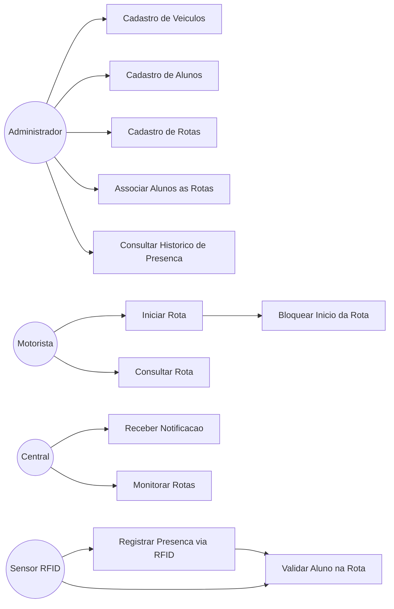
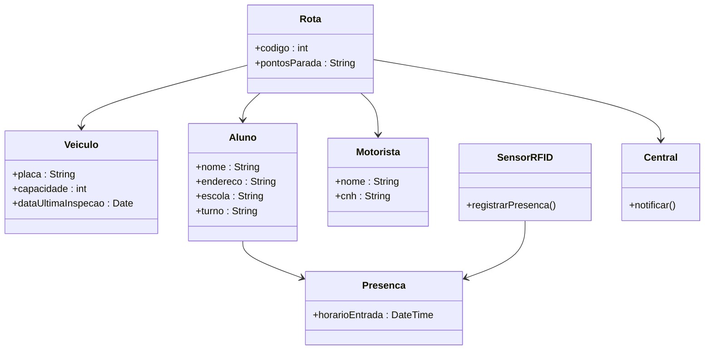
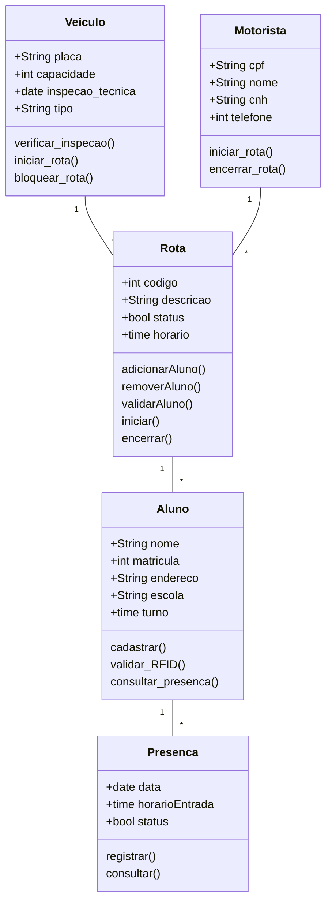
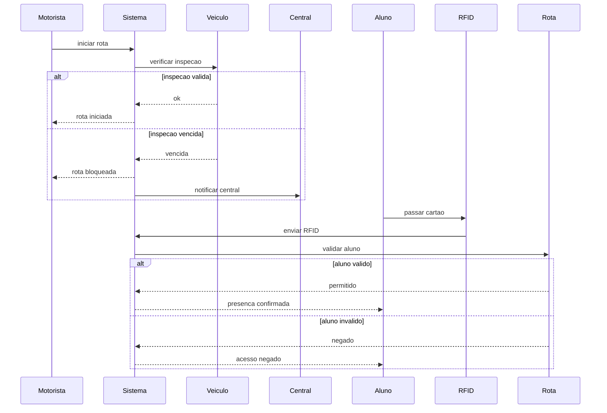

``# Sistema de Transporte Escolar

## 1. Lista de Requisitos

### Requisitos Funcionais (RF)

RF01 – Cadastro de veículos  
O sistema deve permitir cadastrar ônibus e vans contendo placa, capacidade e data da última inspeção técnica.

RF02 – Cadastro de alunos  
O sistema deve permitir cadastrar alunos com endereço, escola e turno.

RF03 – Cadastro de rotas  
O sistema deve permitir cadastrar rotas contendo motorista, veículo e pontos de parada.

RF04 – Associação de alunos às rotas  
O sistema deve permitir vincular alunos a uma rota específica.

RF05 – Registro de presença via RFID  
O sistema deve registrar o horário de entrada do aluno ao passar a carteirinha no sensor.

RF06 – Validação de aluno na rota  
O sistema deve validar se o aluno pertence à rota antes de registrar sua presença.

RF07 – Verificação da inspeção técnica  
O sistema deve verificar se o veículo possui inspeção válida antes de iniciar a rota.

RF08 – Bloqueio de início da rota  
O sistema deve bloquear o início da viagem caso a inspeção esteja vencida.

RF09 – Notificação para a central  
O sistema deve notificar a central quando houver tentativa de iniciar rota com inspeção vencida.

---

### Requisitos Não Funcionais (RNF)

RNF01 – Segurança  
O sistema deve permitir acesso apenas a usuários autorizados.

RNF02 – Desempenho  
A validação do RFID deve ocorrer rapidamente.

RNF03 – Disponibilidade  
O sistema deve funcionar durante os horários escolares.

RNF04 – Armazenamento  
O sistema deve manter histórico de presença dos alunos.

---

# 2. Casos de Uso

---

# 3. Diagrama de Estrutura

---

# 4. Diagrama de Classes

---

# 5. Diagrama de Sequência

