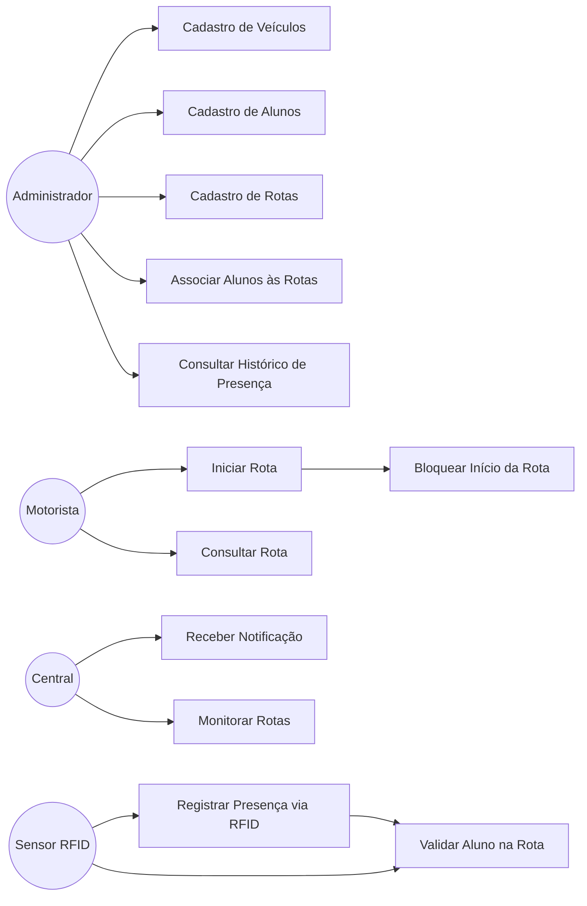
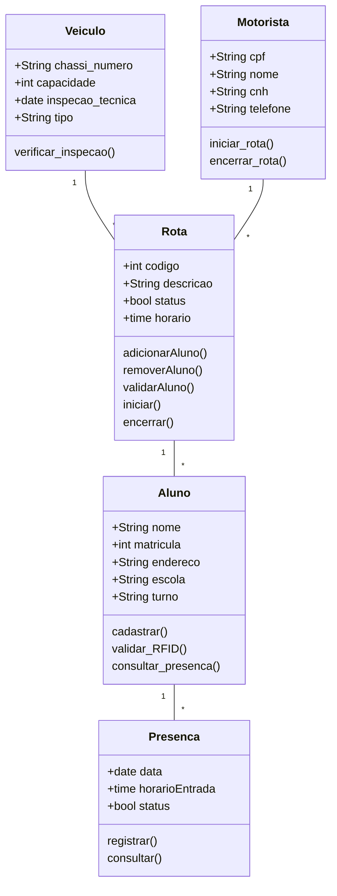

# Sistema de Transporte Escolar com RFID

## Integrantes

* Emerson Ferreira
* Jackson Vitório
* Lucas Felipe
* Marjory Letícia
* Taíná Tarcila

## Descrição

Sistema para gerenciamento de transporte escolar utilizando RFID para controle de presença dos alunos.

## Objetivo

Desenvolver um sistema de transporte escolar com tecnologia RFID para controlar a presença dos alunos, gerenciar veículos, motoristas e rotas, garantindo maior segurança e eficiência no transporte.

# 1. Lista de Requisitos

## Requisitos Funcionais (RF)

### RF01 – Cadastro de Veículos

O sistema deve permitir cadastrar ônibus e vans contendo número do chassi, capacidade e data da última inspeção técnica.

### RF02 – Cadastro de Alunos

O sistema deve permitir cadastrar alunos com endereço, escola e turno.

### RF03 – Cadastro de Rotas

O sistema deve permitir cadastrar rotas contendo motorista, veículo e pontos de parada.

### RF04 – Associação de Alunos às Rotas

O sistema deve permitir vincular alunos a uma rota específica.

### RF05 – Registro de Presença via RFID

O sistema deve registrar o horário de entrada do aluno ao passar a carteirinha no sensor.

### RF06 – Validação de Aluno na Rota

O sistema deve validar se o aluno pertence à rota antes de registrar sua presença.

### RF07 – Verificação da Inspeção Técnica

O sistema deve verificar se o veículo possui inspeção válida antes de iniciar a rota.

### RF08 – Bloqueio de Início da Rota

O sistema deve bloquear o início da viagem caso a inspeção esteja vencida.

### RF09 – Notificação para a Central

O sistema deve notificar a central quando houver tentativa de iniciar rota com inspeção vencida.

## Requisitos Não Funcionais (RNF)

### RNF01 – Segurança

O sistema deve permitir acesso apenas a usuários autorizados.

### RNF02 – Desempenho

A validação do RFID deve ocorrer rapidamente.

### RNF03 – Disponibilidade

O sistema deve funcionar durante os horários escolares.

### RNF04 – Armazenamento

O sistema deve manter histórico de presença dos alunos.

# 2. Casos de Uso

# 3. Diagrama de Estrutura

# 4. Diagrama de Classes

# 5. Diagrama de Sequência

# Ferramentas CASE Utilizadas

Durante o desenvolvimento do Sistema de Transporte Escolar com RFID foram utilizadas ferramentas CASE para apoiar a análise, modelagem e documentação do sistema.

* **Mermaid:** criação dos diagramas de Casos de Uso, Estrutura, Classes e Sequência.
* **GitHub:** controle de versão e gerenciamento colaborativo do projeto.
* **SQLAlchemy:** mapeamento objeto-relacional (ORM) entre as classes Python e o banco de dados.

Essas ferramentas contribuíram para a organização da documentação, rastreabilidade dos requisitos e padronização dos artefatos produzidos.

# Tecnologias Utilizadas

* Python
* SQLAlchemy
* Mermaid
* GitHub

# Conclusão

O sistema proposto permite o gerenciamento do transporte escolar utilizando RFID para registro automático de presença, controle de rotas e validação de inspeções técnicas dos veículos. A solução busca aumentar a segurança dos alunos, melhorar o monitoramento das operações e fornecer maior confiabilidade para gestores, motoristas e responsáveis.
